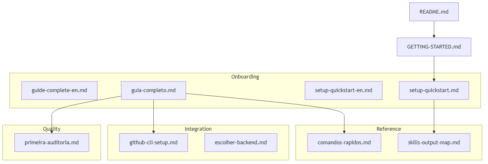

# Hyperion — folder map

Canonical layout for the portable kit.

> **Start here:** [GETTING-STARTED.md](../GETTING-STARTED.md)  
> **Doc index:** [docs/README.md](./docs/README.md)  
> **Organization:** [docs/meta/organizacao.md](./docs/meta/organizacao.md)

---

## Repository root

```
./
├── GETTING-STARTED.md           ← linear onboarding path
├── .cursor/rules/hyperion.mdc   ← Cursor (ships with kit)
├── .github/                     ← AI kit core
├── scripts/
│   ├── hyperion/                ← npm run hyperion:* (help, doctor, setup, sync)
│   └── cards-sync/              ← npm run cards:* (sync engine)
├── CLAUDE.md                    ← Claude Code slash commands
├── package.json                 ← npm shortcuts
├── .env.example                 ← optional token config
└── README.md                    ← thin hub
```

---

## `.github/docs/` — organized guides

| Folder | Contents |
|--------|----------|
| `onboarding/` | guia-completo, setup-quickstart (PT/EN) |
| `reference/` | comandos-rapidos, skills-output-map, methodology |
| `integration/` | github-cli-setup, escolher-backend |
| `quality/` | primeira-auditoria |
| `troubleshooting/` | armadilhas-comuns |
| `meta/` | organizacao, output maps, maintenance policy |
| `adr/`, `retros/` | Generated artifacts |



---

## Cards layout

```
cards/
├── CARD.template.md      ← copy template (never synced)
├── _examples/            ← reference samples (never synced)
├── config/               ← projects-map.json
├── epics|features|stories|tasks/  ← syncable cards
```

---

## Scripts vs agent

| Prefer | When |
|--------|------|
| **`/setup` `/sync` `/doctor`** | Day-to-day — agent runs npm |
| `npm run hyperion:*` | CI, power users |
| `npm run cards:*` | Granular sync |

Command registry: `.github/commands.yml` → `npm run hyperion:generate-rules`  
CI drift check: `npm run hyperion:check-rules`

### Validation scripts (maintainers)

| Script | Purpose |
|--------|---------|
| `npm run docs:check` | Broken markdown links |
| `npm run skills:validate` | Skill frontmatter, `## Output`, unique names |
| `npm run hyperion:check-rules` | Runtime rules match `commands.yml` |
| `npm run cards:test` | cards-sync unit tests |
| `npm run hyperion:test` | pipeline-lib unit tests |
| `npm test` | All unit tests |

---

## Runtime rules (3 surfaces)

| Runtime | File |
|---------|------|
| Cursor | `.cursor/rules/hyperion.mdc` |
| Claude Code | `CLAUDE.md` |
| Copilot | `.github/instructions/copilot-instructions.md` |

Policy: [docs/meta/doc-maintenance-policy.md](./docs/meta/doc-maintenance-policy.md)

---

## Skills (30)

| Category | Count | Folder |
|----------|-------|--------|
| planning | 6 | `skills/planning/` |
| setup | 8 | `skills/setup/` |
| quality | 11 | `skills/quality/` |
| docs | 5 | `skills/docs/` |

## Agents (8)

| Agent | Trigger | File |
|-------|---------|------|
| migration | `/migrate` | `agents/migration.agent.md` |
| spec-review | `/spec-review` | `agents/spec-review.agent.md` |
| implementation-plan | `/implement` | `agents/implementation-plan.agent.md` |
| implementation-executor | `/execute` | `agents/implementation-executor.agent.md` |
| pr-reviewer | `/pr-review` | `agents/pr-reviewer.agent.md` |
| audit-runner | `/audit-run` | `agents/audit-runner.agent.md` |
| release | `/release` | `agents/release.agent.md` |
| mentoring | `/mentor` | `agents/mentoring.agent.md` |

Catalog: [agents/README.md](./agents/README.md)

Output registry: [docs/reference/skills-output-map.md](./docs/reference/skills-output-map.md)
