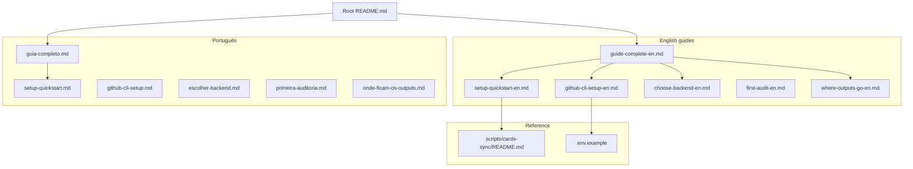

# DevForge Documentation

Central index. Use the table below to find **which document to read**.

---

## Which doc to read?

| Your goal | Read in this order |
|--------------|------------------|
| **Never used DevForge** | [guide-complete-en.md](./guide-complete-en.md) · [PT](./guia-completo.md) |
| **Quick setup (basics understood)** | [setup-quickstart-en.md](./setup-quickstart-en.md) · [PT](./setup-quickstart.md) |
| **GitHub cards sync only** | [github-cli-setup-en.md](./github-cli-setup-en.md) → `npm run cards:init -- --yes` |
| **Jira / Azure / Linear / GitLab** | [choose-backend-en.md](./choose-backend-en.md) · [PT](./escolher-backend.md) |
| **Where generated files go** | [where-outputs-go-en.md](./where-outputs-go-en.md) · [PT](./onde-ficam-os-outputs.md) · [skill map](./skills-output-map.md) |
| **Docs consistency / anti-duplication** | [doc-maintenance-policy.md](./doc-maintenance-policy.md) |
| **Methodology cheat sheet** | [methodology-cheatsheet.md](./methodology-cheatsheet.md) |
| **First repo audit** | [first-audit-en.md](./first-audit-en.md) · [PT](./primeira-auditoria.md) |
| **Sync technical reference** | [scripts/cards-sync/README.md](../../scripts/cards-sync/README.md) |
| **Environment variables** | [`.env.example`](../../.env.example) |
| **Navigate kit folders** | [INDEX.md](../INDEX.md) |
| **Contribute skills** | [CONTRIBUTING.md](../../CONTRIBUTING.md) |

---

## Documentation map

---

## User guides

| Document | Audience | Language |
|-----------|---------|--------|
| [guide-complete-en.md](./guide-complete-en.md) | First-time users | EN |
| [guia-completo.md](./guia-completo.md) | Absolute beginner | PT-BR |
| [setup-quickstart-en.md](./setup-quickstart-en.md) | Setup checklist | EN |
| [setup-quickstart.md](./setup-quickstart.md) | Setup checklist | PT-BR |
| [github-cli-setup-en.md](./github-cli-setup-en.md) | GitHub CLI | EN |
| [github-cli-setup.md](./github-cli-setup.md) | GitHub CLI | PT-BR |
| [choose-backend-en.md](./choose-backend-en.md) | Backend choice | EN |
| [escolher-backend.md](./escolher-backend.md) | Backend choice | PT-BR |
| [where-outputs-go-en.md](./where-outputs-go-en.md) | Output organization | EN |
| [onde-ficam-os-outputs.md](./onde-ficam-os-outputs.md) | Output organization | PT-BR |
| [doc-maintenance-policy.md](./doc-maintenance-policy.md) | Docs consistency policy | EN/PT |
| [first-audit-en.md](./first-audit-en.md) | First audit | EN |
| [primeira-auditoria.md](./primeira-auditoria.md) | First audit | PT-BR |

---

## Fresh clone vs generated artifacts

A **fresh DevForge clone** ships the kit (agents, skills, templates, example cards, guides). Many paths below are **empty until a skill runs** — do not treat them as missing prerequisites.

| Category | Examples | Present on clone? |
|----------|----------|-------------------|
| **Kit (always)** | `agents/`, `skills/`, `memory/` templates, `EXAMPLE-*` cards, `project.example.yml` | Yes |
| **Project config** | `project.yml`, filled `memory/PROJECT.md` | After setup / `project-discovery` |
| **Skill outputs** | ADRs, retros, diagrams, specs, plans, audit results | Created on demand |
| **Greenfield blueprints** | `Project_Architecture_Blueprint.md`, `Project_Folders_Structure_Blueprint.md` | Only after `project-architect` (optional for existing repos) |
| **Team-maintained** | `exemplars.md` | Optional — fill with your team's reference files |

**Fallback rule:** if a blueprint or output folder is missing, skills and agents should use codebase discovery, `project.yml`, and `memory/` — not block waiting for files that were never generated.

Folder READMEs: [adr/README.md](./adr/README.md) · [retros/README.md](./retros/README.md) · [../diagrams/README.md](../diagrams/README.md)

---

## Generated artifacts (by skills)

Artifacts that skills and agents create at runtime — see [where-outputs-go-en.md](./where-outputs-go-en.md):

- ADRs → `.github/docs/adr/` ([README](./adr/README.md))
- Retros → `.github/docs/retros/` ([README](./retros/README.md))
- Diagrams → `.github/diagrams/` ([README](../diagrams/README.md))
- Audit reports → `.github/audits/results/`
- Implementation plans → `.github/plans/implementations/`
- Syncable cards → `.github/cards/`
- Last sync → `.github/plans/cards/last-sync.md`
