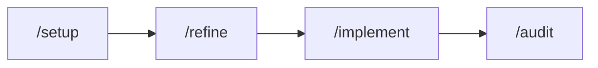

# Armadilhas comuns e gaps de aprendizado

O que mais confunde quem usa o Dev-Kit pela primeira vez — e como evitar.

**English:** [common-pitfalls-en.md](./common-pitfalls-en.md) · **Comandos:** [comandos-rapidos.md](./comandos-rapidos.md)

---

## 1. “Preciso rodar npm o tempo todo?”

**Não.** Desde a v2026 do kit, o caminho preferido é falar com o agente:

| Em vez de… | Diga… |
|------------|-------|
| Copiar comandos do README | **`/setup`** — setup completo guiado |
| `npm run cards:validate` + `sync` | **`/sync`** — agente roda `devkit:sync` |
| Diagnosticar manualmente | **`/doctor`** |

npm continua existindo para CI, power users e quando o agente não tem terminal.

---

## 2. Cursor: regras não carregam

O kit **já inclui** `.cursor/rules/dev-kit.mdc` no clone completo.

Se você copiou só `.github/` + `scripts/`:

```bash
npm run devkit:cursor
```

Ou peça `/setup` — o bootstrap instala as rules automaticamente.

---

## 3. EXAMPLE cards aparecem no board / sync falha

Cards em `.github/cards/_examples/` e `CARD.template.md` são **referência** — nunca vão pro GitHub Project.

| Sintoma | Causa provável |
|---------|----------------|
| “0 cards para sync” no clone limpo | Normal — crie cards em `epics/`, `features/`, etc. |
| EXAMPLE sumiu do board após update | Comportamento correto — eram samples |
| `--only EXAMPLE-*` não synca | Proposital — use `--include-samples` só em manutenção do kit |

---

## 4. Status do card vs coluna do board

**Modo seguro (GitHub Projects):**

| Situação | O que acontece |
|----------|----------------|
| Card **sem** `status` no frontmatter (existente) | Sync **preserva** o que você moveu manualmente no board |
| Usuário pede “mova para Done” | Agente **deve** setar `status: Done` no arquivo e rodar `/sync` |
| Card novo sem status | Vai para `Backlog` |

Confusão comum: mover só no board e esperar que o Markdown atualize sozinho — forward sync não faz reverse de status automaticamente (use `cards:reverse` se precisar).

---

## 5. `gh auth login` vs token no `.env`

| Cenário | Recomendação |
|---------|--------------|
| Dev local | `gh auth login` — auto-detect no doctor/init |
| CI / GitHub Actions | `GITHUB_TOKEN` ou `PROJECT_SYNC_TOKEN` |
| Project de organização | Fine-grained PAT com Issues + Projects |

Sem token: `devkit:setup` roda até validate/dry-run; sync real fica para depois do login.

---

## 6. Muitas skills — por onde começar?

Jornada mínima (ordem sugerida):



| Fase | Comando | Objetivo |
|------|---------|----------|
| Bootstrap | `/setup` | project.yml + memory + cards |
| Planejar | `/refine` | Ideia → cards |
| Executar | `/implement` | Plano por fases |
| Qualidade | `/audit` | Relatórios read-only |

Não precisa decorar 24 skills — [comandos-rapidos.md](./comandos-rapidos.md) cobre 90% do uso.

---

## 7. Auditoria demora / pausa entre dimensões

`full-audit` roda **6 dimensões** e pausa entre elas (por design — evita contexto gigante).

| Expectativa | Realidade |
|-------------|-----------|
| “Auditoria em 2 min” | 10–30 min; depende do tamanho do repo |
| “Altera código” | **Nunca** — só grava em `.github/audits/results/` |
| Escopo parcial | OK — peça “só security + architecture” |

---

## 8. Docs desatualizados vs `devkit:*`

**Fonte de verdade para atalhos:**

1. `npm run devkit:help`
2. [comandos-rapidos.md](./comandos-rapidos.md)
3. `CLAUDE.md` / `.cursor/rules/dev-kit.mdc`
4. Mapa de pastas: [organizacao.md](./organizacao.md)

---

## 9. Backend não-GitHub (Jira, Azure, Linear, GitLab)

GitHub Projects = caminho maduro. Outros backends = forward sync best-effort; reverse e colunas nativas limitadas.

→ [escolher-backend.md](./escolher-backend.md) + skill `integration-bridge` (`/connect`)

---

## 10. O que ainda não existe (expectativa vs kit)

| Usuário espera | Status atual |
|----------------|--------------|
| Um botão “atualizar tudo” que atualiza skills entre repos | Manual — copiar kit novo |
| Slash commands nativos no Cursor | Via rules — não é plugin |
| Sync bidirecional de status em Jira | Metadados na issue; board nativo WIP |
| Vídeo / tutorial interativo | Só markdown |

---

## Quando pedir ajuda ao agente

Frases que desbloqueiam a maioria dos problemas:

- *“Rode `/doctor` e me explica o que falta”*
- *“Estou no Cursor e as rules não pegam — o que copio?”*
- *“Por que meu card não subiu pro Project?”*
- *“Qual a diferença entre project-discovery e /setup?”*

`/setup` = orquestração completa. `project-discovery` = só mapeia repo e `project.yml`.
