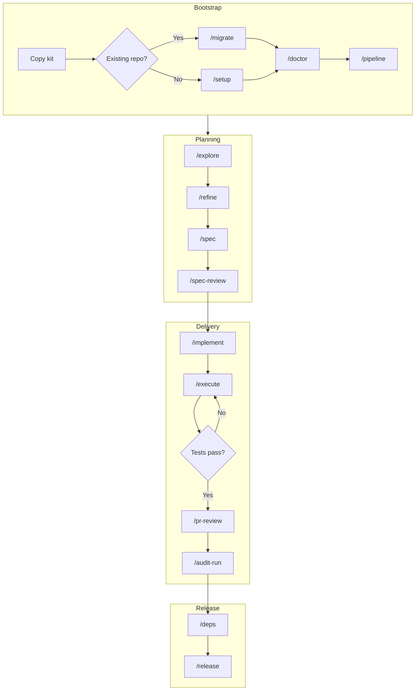

# Hyperion full flow

End-to-end map from zero to release.

**Português:** [fluxo-completo.md](./fluxo-completo.md) · **Learning path:** [learning-path-en.md](../onboarding/learning-path-en.md)

---

## Overview

---

## Phase 0 — Bootstrap

| Step | Command | Output |
|------|---------|--------|
| Copy kit | Manual | `.github/`, `scripts/` |
| Legacy repo | `/migrate` | `project.yml` (report gitignored) |
| Greenfield | `/setup` | `project.yml`, cards |
| Adapt commands | `hyperion:repo-detect` | Suggested `commands.*` |
| Health | `/doctor` | In-session report |

See [adapt-repo-en.md](../onboarding/adapt-repo-en.md).

---

## Phase 1 — Idea → Cards

`/explore` → `/refine` → `/spec` → `/spec-review` → `/sync`

**Gate:** spec-review **approved** before `/implement`.

---

## Phase 2 — Plan → Code → Tests

`/implement` → `/execute` (uses `commands.test` from **your** `project.yml`)

---

## Phase 3 — Quality → Release

`/pr-review` → `/audit-run` → `/deps` → `/release`

---

## Generated artifacts (do not commit)

Session outputs are **gitignored** — folders ship with `.gitkeep` only. See [.gitignore](../../../.gitignore) and [adapt-repo-en.md](../onboarding/adapt-repo-en.md).

---

## Next

[learning-path-en.md](../onboarding/learning-path-en.md) · [quick-commands-en.md](../reference/quick-commands-en.md)

Maintainers: [doc-maintenance-policy.md](./doc-maintenance-policy.md)
