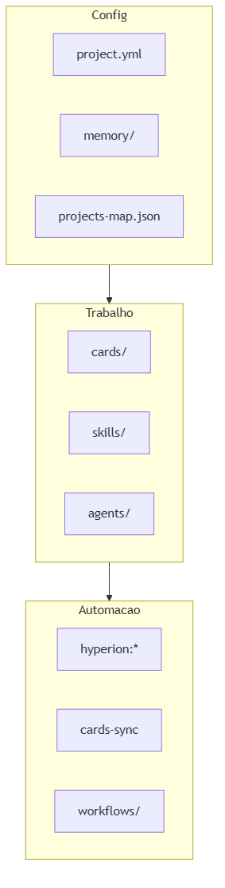

# Organização do Hyperion

Por que a pasta está assim, o que é essencial, o que pode ignorar, e como adotar em **seu** repositório.

**English structure map:** [STRUCTURE.md](../../STRUCTURE.md)

---

## Princípios de organização

1. **`.github/` = cérebro do kit** — skills, agents, cards, audits, docs de metodologia.
2. **`scripts/` = automação determinística** — sync, doctor, setup (agentes delegam aqui).
3. **Runtime rules fora de `.github/`** — `.cursor/rules/`, `CLAUDE.md`, `instructions/` (IDE-specific).
4. **Gerado ≠ versionado** — planos, reviews, migrações, audits: gitignored (`.gitignore`); pastas com `.gitkeep`.
5. **Referência ≠ board** — `_examples/` e templates nunca vão pro GitHub Project.

---

## O que copiar para seu projeto

| Copiar | Obrigatório? |
|--------|--------------|
| `.github/` | Sim (merge se já existir) |
| `scripts/` | Sim (cards-sync + hyperion) |
| `package.json` | Recomendado (`hyperion:*`, `cards:*`) |
| `.cursor/rules/` | Se usar Cursor (já vem no kit completo) |
| `CLAUDE.md` | Se usar Claude Code |
| `.env.example` | Recomendado |

**Não copie:** `.git/` deste repo, artefatos de teste remoto, `project.yml` do kit Hyperion — use `project.example.yml` como base.

---

## O que é desnecessário para o dia a dia

| Item | Pode ignorar? | Notas |
|------|---------------|-------|
| `audits/prompts/*.md` | Sim (agente lê) | Mantenedores de skills |
| `SKILL.template.md` | Sim | Só ao criar skill nova |
| `project.schema.json` | Quase | project-discovery valida |
| Guia completo + EN pairs | Escolha um idioma | Evite ler tudo |
| `exemplars.md` | Sim até ter padrões | Opcional por time |
| `INDEX.md` + `STRUCTURE.md` | Um basta | STRUCTURE = mapa; INDEX = atalho |

---

## Redundâncias intencionais (não “lixo”)

| Camadas | Por quê |
|---------|---------|
| 3 runtime rules | Cursor / Claude / Copilot — sincronizadas via `.github/commands.yml` + `hyperion:generate-rules` |
| Prompt + skill por audit | Prompt = checklist; skill = orquestração + output path |
| PT + EN docs | Mesmo conteúdo, locales diferentes |
| `hyperion:*` + `cards:*` | Master vs granular (CI usa cards direto) |

Fonte anti-duplicação: [doc-maintenance-policy.md](../meta/doc-maintenance-policy.md)

---

## Adotar em monorepo / repo existente

1. Copie o kit → **`/migrate`** (recomendado) ou merge manual de `.github/`.
2. Revise `project.yml` — especialmente `commands` e `management`.
3. `npm run hyperion:doctor` ou **`/doctor`**.
4. Guia: [adaptar-ao-repo.md](../onboarding/adaptar-ao-repo.md).

---

## Árvore mental (3 pilares)

---

## Ver também

- [armadilhas-comuns.md](../troubleshooting/armadilhas-comuns.md) — gaps de aprendizado
- [comandos-rapidos.md](../reference/comandos-rapidos.md) — atalhos agente + npm
- [skills-output-map.md](../reference/skills-output-map.md) — onde cada skill grava arquivos
