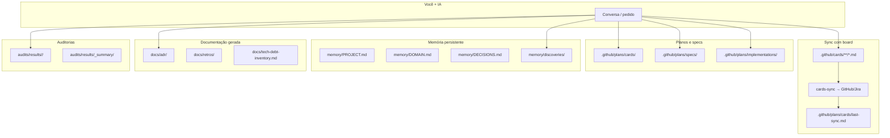

# Onde ficam os arquivos gerados?

**English:** [where-outputs-go-en.md](./where-outputs-go-en.md)

Sim — **cada skill grava na pasta certa**. Este mapa mostra onde encontrar cada tipo de artefato depois que você usar o Dev-Kit.

> **Clone limpo:** pastas como `adr/`, `retros/`, `diagrams/`, `plans/` e `audits/results/` podem estar vazias até a primeira execução da skill. Veja [README — clone vs artefatos gerados](../../README.md#clone-limpo-vs-artefatos-gerados).

Config central: **`project.yml` → `outputs`** (paths podem ser customizados por projeto).

**Mapa skill-a-skill:** [skills-output-map.md](./skills-output-map.md)

---

## Visão geral



---

## Mapa por tipo de artefato

| O que foi gerado | Pasta | Quem grava | Sync com board? |
|------------------|-------|------------|-----------------|
| **Cards individuais** (fonte de verdade) | `.github/cards/epics/` `features/` `stories/` `tasks/` | `card-refiner` | ✅ via cards-sync |
| **Cards consolidados** (leitura humana) | `.github/plans/cards/` | `card-refiner` | ❌ não |
| **Último sync** (log) | `.github/plans/cards/last-sync.md` | `cards-sync` | — |
| **Specs de aceite** | `.github/plans/specs/` | `acceptance-spec` | ❌ |
| **Planos de implementação** | `.github/plans/implementations/` | `implementation-plan` agent | ❌ |
| **Descobertas / hipóteses** | `.github/memory/discoveries/{ID}/` | `hypothesis-forge` | ❌ |
| **ADRs** | `.github/docs/adr/ADR-NNN-slug.md` | `adr-generator` | ❌ |
| **Retros de sprint** | `.github/docs/retros/retro-{sprint}-{date}.md` | `sprint-retro` | ❌ |
| **Tech debt** | `.github/docs/tech-debt-inventory.md` | `tech-debt-tracker` | ❌ |
| **Diagramas PlantUML / Mermaid** | `.github/diagrams/` (ou `outputs.diagrams`) | `plantuml-generator` | ❌ |
| **Blueprints de arquitetura** | `.github/docs/` | `project-architect` | ❌ |
| **Relatórios de auditoria** | `.github/audits/results/<tipo>/` | skills `*-audit`, `full-audit` | ❌ |
| **Resumo full-audit** | `.github/audits/results/_summary/` | `full-audit` | ❌ |

---

## Auditorias — subpastas

Definidas em `.github/audits/manifest.yml`:

| Tipo | Pasta |
|------|-------|
| Architecture | `.github/audits/results/architecture/` |
| Security | `.github/audits/results/application-security/` |
| DevOps | `.github/audits/results/devops/` |
| Code review | `.github/audits/results/code-review/` |
| Product Owner | `.github/audits/results/product-owner/` |
| UX / Design | `.github/audits/results/ux-design/` |

---

## Cards — regra de ouro

```
.github/cards/     ← UMA fonte de verdade (sync lê daqui)
.github/plans/cards/ ← README humano (opcional, card-refiner)
```

- **Nunca** duplique card_id em dois arquivos em `cards/`
- Evolução conversacional (*"mova para Done"*) edita o **mesmo** arquivo em `cards/`

---

## Memória vs outputs gerados

| Pasta | Propósito |
|-------|-----------|
| `.github/memory/` | Contexto **estável** que a IA relê (PROJECT, DOMAIN, DECISIONS, discoveries) |
| `.github/plans/` | Artefatos de **sessão/planejamento** |
| `.github/audits/results/` | Relatórios pontuais (podem ser gitignored em prod) |
| `.github/docs/adr/` | Decisões arquiteturais permanentes |

---

## Customizar paths

Em `.github/project.yml`:

```yaml
outputs:
  audits: .github/audits/results
  cards: .github/plans/cards
  implementations: .github/plans/implementations
```

Skills leem `project.yml` e usam esses paths quando configurados.

---

## O que NÃO misturar

| ❌ Evite | ✅ Prefira |
|---------|-----------|
| Card novo a cada mudança de status | Editar o mesmo `.md` em `cards/` |
| Relatório de audit na raiz do repo | `audits/results/<tipo>/` |
| ADR solto em `/docs` | `.github/docs/adr/` |
| Plano de implementação em `/tmp` | `.github/plans/implementations/` |

---

## Próximos passos

- [Guia completo](./guia-completo.md)
- [Primeira auditoria](./primeira-auditoria.md)
- [Índice da documentação](./README.md)

English: [guide-complete-en.md](./guide-complete-en.md) · [where-outputs-go-en.md](./where-outputs-go-en.md)
