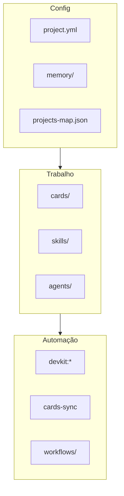

# Organização do Dev-Kit

Por que a pasta está assim, o que é essencial, o que pode ignorar, e como adotar em **seu** repositório.

**English structure map:** [STRUCTURE.md](../STRUCTURE.md)

---

## Princípios de organização

1. **`.github/` = cérebro do kit** — skills, agents, cards, audits, docs de metodologia.
2. **`scripts/` = automação determinística** — sync, doctor, setup (agentes delegam aqui).
3. **Runtime rules fora de `.github/`** — `.cursor/rules/`, `CLAUDE.md`, `instructions/` (IDE-specific).
4. **Gerado ≠ versionado** — relatórios, specs e plans de sessão ficam gitignored; pastas existem via `.gitkeep`.
5. **Referência ≠ board** — `_examples/` e templates nunca vão pro GitHub Project.

---

## O que copiar para seu projeto

| Copiar | Obrigatório? |
|--------|--------------|
| `.github/` | Sim (merge se já existir) |
| `scripts/` | Sim (cards-sync + devkit) |
| `package.json` | Recomendado (`devkit:*`, `cards:*`) |
| `.cursor/rules/` | Se usar Cursor (já vem no kit completo) |
| `CLAUDE.md` | Se usar Claude Code |
| `.env.example` | Recomendado |

**Não copie:** `.git/` deste repo, artefatos de teste remoto, `project.yml` do kit Dev-Kit — use `project.example.yml` como base.

---

## O que é desnecessário para o dia a dia

| Item | Pode ignorar? | Notas |
|------|---------------|-------|
| `audits/prompts/*.md` | Sim (agente lê) | Mantenedores de skills |
| `SKILL.template.md` | Sim | Só ao criar skill nova |
| `project.schema.json` | Quase | project-discovery valida |
| Guia completo + EN pairs | Escolha um idioma | Evite ler tudo |
| `exemplars.md` | Sim até ter padrões | Opcional por time |
| `INDEX.md` + `STRUCTURE.md` | Um basta | STRUCTURE = mapa; INDEX = atalho |

---

## Redundâncias intencionais (não “lixo”)

| Camadas | Por quê |
|---------|---------|
| 3 runtime rules | Cursor / Claude / Copilot não compartilham formato |
| Prompt + skill por audit | Prompt = checklist; skill = orquestração + output path |
| PT + EN docs | Mesmo conteúdo, locales diferentes |
| `devkit:*` + `cards:*` | Master vs granular (CI usa cards direto) |

Fonte anti-duplicação: [doc-maintenance-policy.md](./doc-maintenance-policy.md)

---

## Proposta de limpeza aplicada neste kit

| Mudança | Benefício |
|---------|-----------|
| `.cursor/rules/dev-kit.mdc` canônico | Cursor funciona no clone — fim do gap “copiar rules/” |
| `rules/` removido da raiz | Uma localização só |
| `audits/README.md` + prompts README corrigido | Links quebrados removidos |
| `.gitkeep` em specs/, implementations/, results/ | Árvore = docs |
| `STRUCTURE.md` | Mapa único da pasta `.github/` |
| `npm run devkit:cursor` | Reinstala rules se copiar só `.github/` + `scripts/` |

---

## Adotar em monorepo / repo existente

1. Merge `.github/` — resolver conflitos em `workflows/` manualmente.
2. `/setup` ou `project-discovery` Configure → `project.yml` **do seu produto**.
3. Preencher `memory/PROJECT.md`.
4. `npm run devkit:setup -- --yes` ou `/setup`.
5. Overlay de auditoria opcional: `audits/overlays/seu-produto.md`.

---

## Árvore mental (3 pilares)

---

## Ver também

- [armadilhas-comuns.md](./armadilhas-comuns.md) — gaps de aprendizado
- [comandos-rapidos.md](./comandos-rapidos.md) — atalhos agente + npm
- [skills-output-map.md](./skills-output-map.md) — onde cada skill grava arquivos
