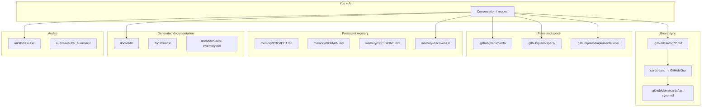

# Where do generated files go?

Yes — **every skill writes to the right folder**. This map shows where to find each artifact after using Dev-Kit.

> **Fresh clone:** folders such as `adr/`, `retros/`, `diagrams/`, `plans/`, and `audits/results/` may be empty until the first skill run. See [README — fresh clone vs generated artifacts](../../README.md#clone-limpo-vs-artefatos-gerados).

Central config: **`project.yml` → `outputs`** (paths can be customized per project).

**Português:** [onde-ficam-os-outputs.md](./onde-ficam-os-outputs.md)

---

## Overview



---

## Map by artifact type

| Generated | Folder | Written by | Board sync? |
|------------------|-------|------------|-----------------|
| **Individual cards** (source of truth) | `.github/cards/epics/` `features/` `stories/` `tasks/` | `card-refiner` | ✅ via cards-sync |
| **Consolidated cards** (human reading) | `.github/plans/cards/` | `card-refiner` | ❌ no |
| **Last sync** (log) | `.github/plans/cards/last-sync.md` | `cards-sync` | — |
| **Acceptance specs** | `.github/plans/specs/` | `acceptance-spec` | ❌ |
| **Implementation plans** | `.github/plans/implementations/` | `implementation-plan` agent | ❌ |
| **Discoveries / hypotheses** | `.github/memory/discoveries/{ID}/` | `hypothesis-forge` | ❌ |
| **ADRs** | `.github/docs/adr/ADR-NNN-slug.md` | `adr-generator` | ❌ |
| **Sprint retros** | `.github/docs/retros/retro-{sprint}-{date}.md` | `sprint-retro` | ❌ |
| **Tech debt** | `.github/docs/tech-debt-inventory.md` | `tech-debt-tracker` | ❌ |
| **PlantUML / Mermaid diagrams** | `.github/diagrams/` (or `outputs.diagrams`) | `plantuml-generator` | ❌ |
| **Architecture blueprints** | `.github/docs/` | `project-architect` | ❌ |
| **Audit reports** | `.github/audits/results/<type>/` | `*-audit`, `full-audit` | ❌ |
| **Full audit summary** | `.github/audits/results/_summary/` | `full-audit` | ❌ |

---

## Audits — subfolders

Defined in `.github/audits/manifest.yml`:

| Type | Folder |
|------|-------|
| Architecture | `.github/audits/results/architecture/` |
| Security | `.github/audits/results/application-security/` |
| DevOps | `.github/audits/results/devops/` |
| Code review | `.github/audits/results/code-review/` |
| Product Owner | `.github/audits/results/product-owner/` |
| UX / Design | `.github/audits/results/ux-design/` |

---

## Cards — golden rule

```
.github/cards/     ← ONE source of truth (sync reads from here)
.github/plans/cards/ ← Human README (optional, card-refiner)
```

- **Never** duplicate `card_id` in two files under `cards/`
- Conversational evolution (*"move to Done"*) edits the **same** file in `cards/`

---

## Memory vs generated outputs

| Folder | Purpose |
|-------|-----------|
| `.github/memory/` | **Stable** context the AI re-reads (PROJECT, DOMAIN, DECISIONS, discoveries) |
| `.github/plans/` | **Session/planning** artifacts |
| `.github/audits/results/` | Point-in-time reports (may be gitignored in prod) |
| `.github/docs/adr/` | Permanent architectural decisions |

---

## Customize paths

In `.github/project.yml`:

```yaml
outputs:
  audits: .github/audits/results
  cards: .github/plans/cards
  implementations: .github/plans/implementations
```

Skills read `project.yml` and use these paths when configured.

---

## What NOT to mix

| ❌ Avoid | ✅ Prefer |
|---------|-----------|
| New card file on every status change | Edit the same `.md` in `cards/` |
| Audit report at repo root | `audits/results/<type>/` |
| ADR loose in `/docs` | `.github/docs/adr/` |
| Implementation plan in `/tmp` | `.github/plans/implementations/` |

---

## Next steps

- [Complete guide](./guide-complete-en.md)
- [First audit](./first-audit-en.md)
- [Documentation index](./README.md)

Português: [guia-completo.md](./guia-completo.md) · [onde-ficam-os-outputs.md](./onde-ficam-os-outputs.md)
