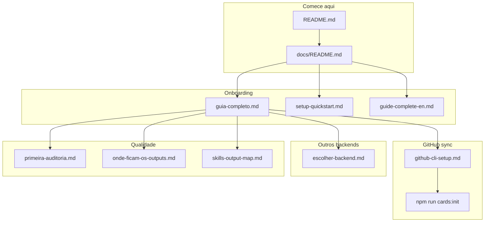
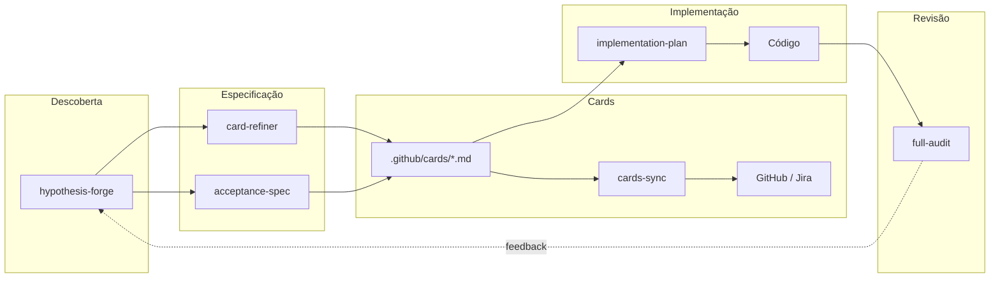

# Dev-Kit

[](LICENSE)


Kit portátil e agnóstico de agentes e skills de IA para projetos de software. Funciona com GitHub Copilot, Cursor, Claude Code ou qualquer assistente de IA que leia instruções em Markdown.

<details>
<summary>🇺🇸 English version</summary>

Portable, runtime-agnostic AI agents and skills kit. Works with Copilot, Cursor, Claude Code, or any assistant that reads Markdown.

**Full guides (EN):**
- **[Complete guide](./.github/docs/guide-complete-en.md)**
- **[5-minute setup](./.github/docs/setup-quickstart-en.md)**
- **[GitHub CLI setup](./.github/docs/github-cli-setup-en.md)**
- **[Choose backend](./.github/docs/choose-backend-en.md)**
- **[First audit](./.github/docs/first-audit-en.md)**
- **[Where outputs go](./.github/docs/where-outputs-go-en.md)**
- **[Documentation index](./.github/docs/README.md)**

Skill names and paths use English identifiers. User guides are available in **PT-BR and EN**.

</details>

---

## Sumário

- [Qual doc ler?](#qual-doc-ler)
- [O que está incluído](#o-que-está-incluído)
- [Clone limpo vs artefatos gerados](#clone-limpo-vs-artefatos-gerados)
- [Onde ficam os arquivos gerados](#onde-ficam-os-arquivos-gerados)
- [Quickstart](#quickstart)
- [Comandos (Como Usar)](#comandos-como-usar)
- [Cards Sync](#cards-sync)
- [Personalização](#personalização)
- [Fluxo de Trabalho](#fluxo-de-trabalho)
- [Compatibilidade de Runtime](#compatibilidade-de-runtime)
- [Estrutura do Kit](#estrutura-do-kit)
- [Contribuindo](#contribuindo)
- [Licença](#licença)

### Documentação detalhada

| Doc | Para quê |
|-----|----------|
| [Guia completo](./.github/docs/guia-completo.md) | Nunca usei — leia primeiro |
| [Setup 5 min](./.github/docs/setup-quickstart.md) | Checklist após copiar o kit |
| [GitHub CLI](./.github/docs/github-cli-setup.md) | `gh auth login` — automação local |
| [Escolher backend](./.github/docs/escolher-backend.md) | GitHub vs Jira vs outros |
| [Primeira auditoria](./.github/docs/primeira-auditoria.md) | Rodar full-audit |
| [Onde ficam os outputs](./.github/docs/onde-ficam-os-outputs.md) | Mapa de arquivos gerados |
| [Guia EN](./.github/docs/guide-complete-en.md) | Complete guide (English) |
| [Setup EN](./.github/docs/setup-quickstart-en.md) | 5-minute setup (English) |
| [Mapa skill-a-skill](./.github/docs/skills-output-map.md) | Onde cada skill grava outputs |
| [Política de manutenção de docs](./.github/docs/doc-maintenance-policy.md) | Reduz redundância e drift de documentação |
| [Cheat sheet metodologia](./.github/docs/methodology-cheatsheet.md) | Agent vs skill vs artefato gerado |
| [Índice docs](./.github/docs/README.md) | Mapa completo da documentação |

---

## Qual doc ler?

| Objetivo | Documento |
|----------|-----------|
| **Primeira vez no Dev-Kit** | [guia-completo.md](./.github/docs/guia-completo.md) |
| **Setup rápido** | [setup-quickstart.md](./.github/docs/setup-quickstart.md) |
| **Comandos rápidos** | [comandos-rapidos.md](./.github/docs/comandos-rapidos.md) — `/setup`, `/sync`, `/audit` |
| **Armadilhas comuns** | [armadilhas-comuns.md](./.github/docs/armadilhas-comuns.md) |
| **Organização do kit** | [organizacao.md](./.github/docs/organizacao.md) · [STRUCTURE.md](./.github/STRUCTURE.md) |
| **Sync cards no GitHub** | [github-cli-setup.md](./.github/docs/github-cli-setup.md) → `npm run devkit:setup -- --yes` ou `/setup` |
| **Jira / Azure / Linear / GitLab** | [escolher-backend.md](./.github/docs/escolher-backend.md) |
| **Auditar o repo** | [primeira-auditoria.md](./.github/docs/primeira-auditoria.md) |
| **Referência técnica sync** | [scripts/cards-sync/README.md](./scripts/cards-sync/README.md) |
| **Onde ficam os arquivos gerados?** | [onde-ficam-os-outputs.md](./.github/docs/onde-ficam-os-outputs.md) |
| **English (full guides)** | [guide-complete-en.md](./.github/docs/guide-complete-en.md) · [docs index](./.github/docs/README.md) |

### Mapa visual



---

## O que está incluído

### Agentes (fluxos autônomos)

| Agente | Propósito |
|--------|-----------|
| **implementation-plan** | Lê qualquer card/ticket, gera plano de execução em fases com gates de validação humana |
| **mentoring** | Mentor socrático (Sensei) — ensina por perguntas, adapta-se ao nível do aprendiz |

### Skills (capacidades sob demanda)

Organizadas em `.github/skills/` por categoria:

| Categoria | Skill | O que faz |
|-----------|-------|-----------|
| **planning/** | hypothesis-forge | Exploração de problema: persona, impacto, hipótese, decisão |
| | acceptance-spec | Gerador de especificação de aceitação (Given/When/Then) |
| | card-refiner | Cria e evolui cards (YAML + corpo amigável); sync automático com links no GitHub |
| | project-architect | Planejador de arquitetura greenfield com passos guiados |
| | refactor-guide | Guia de refatoração segura e incremental |
| | sprint-retro | Facilitador de retrospectiva de sprint |
| **setup/** | project-startup | Setup completo guiado (`/setup`) |
| | devkit-ops | Agente roda doctor/sync/setup npm por você |
| | project-discovery | Mapeia layout do repo, stack, docs; cria project.yml |
| | cards-sync-setup | Wizard para configurar sync de cards com GitHub Issues + Projects |
| | integration-bridge | Conecta a Jira, Azure DevOps, Linear ou GitLab via MCP/API |
| **quality/** | full-audit | Orquestra todos os 6 tipos de auditoria abaixo |
| | security-audit | Revisão de segurança aplicacional baseada em OWASP |
| | architecture-audit | Revisão estrutural e de padrões |
| | devops-audit | Revisão de CI/CD, infra e deploy |
| | code-review | Revisão de qualidade de código (nível senior) |
| | po-audit | Cobertura de requisitos e alinhamento de produto |
| | ux-audit | Revisão de UX e Design System |
| | testing-strategy | Gera plano e estratégia de testes (unit/integration/e2e) |
| | tech-debt-tracker | Identifica, prioriza e rastreia débito técnico |
| **docs/** | adr-generator | Architecture Decision Records |
| | plantuml-generator | Diagramas PlantUML + C4 |
| | readme-updater | Manutenção periódica do README |
| | changelog-generator | Gera CHANGELOG a partir de commits convencionais |

### Infraestrutura

| Componente | Propósito |
|------------|-----------|
| `project.yml` | Contrato único que conecta o kit genérico ao seu projeto específico |
| `project.schema.json` | JSON Schema para validação |
| `memory/` | Contexto persistente (PROJECT, DOMAIN, DECISIONS) lido por todos os agentes |
| `cards/` | Arquivos de card com YAML frontmatter para sync multi-backend |
| `audits/manifest.yml` | Mapeia tipos de auditoria para skills, prompts e diretórios de output |
| `scripts/cards-sync/` | Sync: Markdown cards → GitHub / Jira / Azure / Linear / GitLab |

### Clone limpo vs artefatos gerados

Em um **clone limpo** do Dev-Kit, você recebe o kit base: agentes, skills, templates, exemplos de cards e documentação. Várias pastas e arquivos **não vêm preenchidos** — são criados quando você (ou a IA) roda skills e agents.

| Tipo | Exemplos | Quando aparece |
|------|----------|----------------|
| **Sempre no kit** | `.github/agents/`, `.github/skills/`, `.github/memory/` (templates), `CARD.template.md`, `_examples/` (samples), `project.example.yml` | Clone inicial |
| **Config do seu projeto** | `.github/project.yml`, `.env`, `.github/memory/PROJECT.md` preenchido | Após setup / `project-discovery` |
| **Gerados por skills** | ADRs, retros, diagramas, specs, planos, resultados de auditoria | Quando a skill correspondente roda |
| **Gerados por `project-architect`** | `Project_Architecture_Blueprint.md`, `Project_Folders_Structure_Blueprint.md` | Projetos greenfield — opcional em repos existentes |
| **Opcional / time preenche** | `.github/docs/exemplars.md` | Catálogo de padrões do seu time |

> **Regra prática:** se um arquivo ou pasta não existir, a IA deve usar fallback — `project-discovery`, leitura do código e `.github/memory/` — em vez de assumir que o blueprint já está lá.

Detalhes por pasta: [adr/README.md](./.github/docs/adr/README.md) · [retros/README.md](./.github/docs/retros/README.md) · [diagrams/README.md](./.github/diagrams/README.md)

### Onde ficam os arquivos gerados?

Sim — **cada skill grava na pasta certa**. Resumo:

| Tipo | Pasta |
|------|-------|
| Cards (sync) | `.github/cards/` |
| Specs | `.github/plans/specs/` |
| Planos de implementação | `.github/plans/implementations/` |
| Auditorias | `.github/audits/results/` |
| ADRs | `.github/docs/adr/` |
| Memória / descobertas | `.github/memory/` |

Mapa completo com diagrama: **[onde-ficam-os-outputs.md](./.github/docs/onde-ficam-os-outputs.md)** · [EN](./.github/docs/where-outputs-go-en.md) · [skill-a-skill](./.github/docs/skills-output-map.md)

---

## Quickstart

Guia detalhado: **[Guia completo](./.github/docs/guia-completo.md)** · Setup: **[5 minutos](./.github/docs/setup-quickstart.md)** · Automação GitHub: **[GitHub CLI](./.github/docs/github-cli-setup.md)**

### 0. GitHub CLI (automação de cards no GitHub)

Para o sync descobrir repo, token e Project sozinho:

1. Instale e faça login — **[tutorial completo](./.github/docs/github-cli-setup.md)**
2. Depois: **`/setup`** ou `npm run devkit:setup -- --yes`

Sem `gh`, use `GITHUB_TOKEN` no `.env` (menos automático).

### 1. Copie o kit

Copie a pasta `.github/` e a pasta `scripts/` para o seu repositório.

Opcional: `CLAUDE.md`, `.cursor/rules/` (incluso no kit), `.env.example`, `package.json` (atalhos `devkit:*` e `cards:*`).

### 2. Configure seu projeto

```bash
# Opção A: Deixe a IA descobrir seu projeto
# Peça ao seu agente: "Rode project-discovery em modo Configure"

# Opção B: Manual
cp .github/project.example.yml .github/project.yml
# Edite project.yml com os detalhes do seu projeto
```

### 3. Preencha a memória (opcional, mas recomendado)

Edite os templates em `.github/memory/`:
- `PROJECT.md` — o que é este projeto, quem trabalha nele
- `DOMAIN.md` — entidades, fluxos, regras de negócio
- `DECISIONS.md` — decisões-chave já tomadas

### 4. Comece a usar

Fale com seu agente de IA naturalmente:
- "Refina essa ideia de feature em cards" → aciona `card-refiner`
- "Vamos explorar esse problema" → aciona `hypothesis-forge`
- "Implementa esse card" → aciona `implementation-plan`
- "Faz uma auditoria completa do repo" → aciona `full-audit`
- "Me ajuda a entender esse código" → aciona `mentoring`

---

## Comandos (Como Usar)

Fale com seu agente de IA naturalmente. Frases-chave que acionam cada skill:

### Planejamento e Descoberta

| Diga isso | Aciona | O que acontece |
|-----------|--------|----------------|
| "Vamos explorar esse problema" | `hypothesis-forge` | Sessão: Problema → Hipótese → Decisão |
| "Refina essa ideia em cards" | `card-refiner` | Gera cards estruturados com YAML frontmatter |
| "Escreve spec de aceitação para X" | `acceptance-spec` | Cenários Given/When/Then + breakdown de tasks |
| "Planeja a arquitetura" | `project-architect` | Design de arquitetura greenfield guiado |
| "Guia essa refatoração" | `refactor-guide` | Refatoração segura passo a passo |
| "Vamos fazer a retro" | `sprint-retro` | Retrospectiva facilitada com action items |
| "Registra essa decisão" | `adr-generator` | Cria ADR em `.github/docs/adr/` |

### Implementação

| Diga isso | Aciona | O que acontece |
|-----------|--------|----------------|
| "Implementa esse card" | `implementation-plan` | Plano em fases com gates humanos |
| "Me ajuda a entender isso" | `mentoring` | Ensino socrático por perguntas |

### Qualidade e Auditorias

| Diga isso | Aciona | O que acontece |
|-----------|--------|----------------|
| "Faz auditoria completa" | `full-audit` | Executa as 6 dimensões de auditoria |
| "Revisão de segurança" | `security-audit` | Análise de segurança baseada em OWASP |
| "Revisa a arquitetura" | `architecture-audit` | Revisão de padrões estruturais |
| "Code review" | `code-review` | Revisão de qualidade (dev senior) |
| "Revisão de DevOps" | `devops-audit` | Revisão de CI/CD e infra |
| "Alinhamento de produto" | `po-audit` | Revisão de cobertura de requisitos |
| "Revisão de UX" | `ux-audit` | Revisão de design system e UX |
| "Estratégia de testes" | `testing-strategy` | Plano de testes priorizados |
| "Qual tech debt temos?" | `tech-debt-tracker` | Inventário de débito técnico priorizado |

### Setup e Manutenção

| Diga isso | Aciona | O que acontece |
|-----------|--------|----------------|
| **`/setup`** ou "Configura o Dev-Kit" | `project-startup` | Setup completo guiado (project.yml + memory + cards) |
| **`/doctor`** ou "Rode o doctor" | `devkit-ops` | Verifica saúde do kit — agente roda npm por você |
| **`/sync`** ou "Sincroniza os cards" | `devkit-ops` | Valida e sync cards — sem terminal manual |
| **`/help`** ou "Lista comandos" | `devkit:help` | Referência de atalhos |
| "Descobre esse projeto" | `project-discovery` | Mapeia layout, stack, cria project.yml |
| "Configura cards sync" | `cards-sync-setup` | Wizard para integração com GitHub Projects |
| "Conecta ao Jira/Azure/Linear/GitLab" | `integration-bridge` | Configura ponte com ferramenta externa |
| "Atualiza o README" | `readme-updater` | Atualiza README com estado atual |
| "Gera diagrama de arquitetura" | `plantuml-generator` | Diagramas PlantUML/Mermaid + C4 |
| "Gera changelog" | `changelog-generator` | CHANGELOG.md a partir do git log |

Referência completa: [comandos-rapidos.md](./.github/docs/comandos-rapidos.md)

### Dev-Kit CLI (npm — opcional se usar agente)

Pré-requisito GitHub: [`gh auth login`](./.github/docs/github-cli-setup.md)

```bash
npm run devkit:help              # lista todos os atalhos
npm run devkit:doctor            # saúde kit + cards
npm run devkit:setup -- --yes    # bootstrap completo
npm run devkit:sync              # validate + sync
```

### Cards Sync (npm granular)

Pré-requisito GitHub: [`gh auth login`](./.github/docs/github-cli-setup.md)

```bash
# Bootstrap completo (recomendado na 1ª vez)
npm run cards:init
npm run cards:init -- --yes              # + sync real

# Comandos avulsos
npm run cards:doctor
npm run cards:validate
npm run cards:dry-run
npm run cards:sync
npm run cards:watch                      # sync incremental ao salvar
npm run cards:sync -- --only CARD-ID     # sync de um card

# Reverse sync
npm run cards:reverse
CARDS_SYNC_BACKEND=jira npm run cards:sync -- --reverse
```

---

## Cards Sync

O kit inclui sync automatizado de Markdown cards para boards de gestão:

1. Cards em `.github/cards/` com YAML frontmatter (copie `CARD.template.md`)
2. Push dispara workflow → cria/atualiza items remotos (Issues, work items, etc.)
3. No GitHub: preenche campos do Project, labels, sub-issues e **corpo da issue com links**

Veja `scripts/cards-sync/README.md` para documentação completa.

### Ordem recomendada (primeira execução — GitHub)

**Caminho automático (recomendado):**

```bash
# 1. GitHub CLI — ver tutorial se ainda não instalou
gh auth login

# 2. Bootstrap completo (discover project → doctor → validate → sync)
npm run devkit:setup -- --yes
# ou peça ao agente: /setup

# 3. Dia a dia (opcional)
npm run cards:watch
```

Pré-requisitos: kit copiado, `git remote` apontando para GitHub, [GitHub CLI configurado](./.github/docs/github-cli-setup.md).

<details>
<summary>Setup manual (avançado — se não usar cards:init)</summary>

1. Configurar `.github/project.yml` (via `project-discovery` em Configure mode)
2. Ajustar `.github/cards/config/projects-map.json` (owner/number/fieldMap/locale)
3. `npm run cards:doctor`
4. `npm run cards:validate`
5. `npm run cards:dry-run`
6. `npm run cards:sync`

</details>

**Outros backends (Jira, etc.):** [escolher-backend.md](./.github/docs/escolher-backend.md)

**Features zero-config (GitHub + `gh auth login`):**
- Auto-detecta repositório pelo git remote
- Auto-detecta token pelo GitHub CLI (`gh auth token`)
- Auto-cria Project se nenhum existir
- Auto-cria labels faltantes
- Auto-salva projectNumber após criação

**Multi-backend (adaptável):**
- GitHub Projects (default, totalmente implementado)
- GitHub full + Jira (forward + reverse, piloto) + Azure DevOps/Linear/GitLab forward best-effort
- Labels i18n: `labels.en.json` / `labels.pt-BR.json` (configura por locale)

**Comportamento de Status (modo seguro — GitHub Projects):**
- Se `status` vier no frontmatter do card, o sync aplica esse status.
- Se `status` não vier:
  - cards novos nascem em `defaults.status` (geralmente `Backlog`)
  - cards existentes preservam status manual no board.
- Se você editar o `status` na IDE e rodar `/sync` (ou `npm run devkit:sync`), o board é atualizado.
- Em repositórios GitHub, o push também dispara `.github/workflows/sync-cards.yml` e sincroniza automaticamente.

## Automação GitHub (plug and play)

| Comando | O que faz |
|---------|-----------|
| `npm run cards:init` | Bootstrap completo: descobre Project → doctor → validate → dry-run → sync |
| `npm run cards:init -- --yes` | Igual acima + sync real sem perguntar |
| `npm run cards:init -- --install-hook` | Instala pre-commit que valida cards alterados |
| `npm run cards:watch` | Sync **incremental** ao salvar `.md` em `.github/cards/` |
| `npm run cards:sync -- --only ID1,ID2` | Sync só cards específicos (+ pais na hierarquia) |

**Auto-discovery:** se `projectNumber` estiver vazio, o sync busca no GitHub um Project chamado `[RepoName] Dev-Kit Project` (ou o único project do repo) e salva em `projects-map.json`.

**Resumo:** cada sync grava `.github/plans/cards/last-sync.md` com ações (criado/atualizado/movido).

**Evolução conversacional (agente):**
- Peça em linguagem natural: *"mova EXAMPLE-STORY-001 para Done"* ou *"coloca o card 001 em In Progress"*.
- O agente edita o frontmatter do arquivo existente em `.github/cards/`, valida e roda o sync.
- **GitHub:** coluna Status do Project atualiza. **Jira/outros:** status vai para metadados da issue (board nativo ainda não mapeado).
- Skill: `card-refiner` § Card evolution during conversation.

---

## Personalização

### Labels

Edite `.github/cards/config/projects-map.json` para adicionar/remover labels. O sync cria automaticamente qualquer label faltante no repo.

### Overlays de auditoria

Crie `.github/audits/overlays/seu-projeto.md` com contexto de domínio que complementa os prompts genéricos. Referencie em `project.yml`:

```yaml
audits:
  overlay: .github/audits/overlays/seu-projeto.md
```

### Mapeamento de campos

Se seu GitHub Project usa nomes de campo diferentes, atualize `fieldMap` em `projects-map.json`.

---

## Fluxo de Trabalho



1. **Descoberta** — Entender o problema (`hypothesis-forge`)
2. **Especificação** — Definir o que construir (`card-refiner` ou `acceptance-spec`)
3. **Planejamento** — Gerar plano de implementação (`implementation-plan`)
4. **Execução** — Implementar fase por fase com gates humanos
5. **Revisão** — Validar qualidade ([primeira-auditoria](./.github/docs/primeira-auditoria.md), `full-audit`, `code-review`)

---

## Compatibilidade de Runtime

| Runtime | Arquivo de config | Suporte |
|---------|-------------------|---------|
| GitHub Copilot | `.github/instructions/copilot-instructions.md` | Agents em `.github/agents/`, skills em `.github/skills/` |
| Cursor | `.cursor/rules/dev-kit.mdc` (incluso) | Rules + skills em `.github/` |
| Claude Code | `CLAUDE.md` (raiz) | Commands `/discover`, `/audit`, `/review`, etc. mapeados para skills |
| Qualquer outro | — | Skills são markdown puro — qualquer LLM consegue seguir |

---

## Estrutura do Kit

```
Dev-Kit/
├── README.md
├── CLAUDE.md                  → Config para Claude Code
├── CONTRIBUTING.md            → Guia de contribuição
├── .gitignore
├── .cursor/rules/dev-kit.mdc → Cursor (incluso no kit)
├── .env.example               → Variáveis de ambiente (alternativa ao gh)
├── package.json               → Atalhos npm run devkit:* e cards:*
├── scripts/cards-sync/        → Engine de sincronização
└── .github/
    ├── INDEX.md               → Guia de navegação das pastas
    ├── agents/                → Agentes autônomos (2)
    ├── audits/                → Manifesto + prompts + resultados
    │   ├── manifest.yml
    │   ├── prompts/
    │   ├── overlays/
    │   └── results/
    ├── cards/                 → Cards sincronizáveis
    │   ├── config/            → projects-map.json
    │   ├── epics/
    │   ├── features/
    │   ├── stories/
    │   └── tasks/
    ├── docs/
    │   ├── README.md            → Índice: qual doc ler
    │   ├── guia-completo.md     → Guia do zero (iniciantes)
    │   ├── setup-quickstart.md  → Setup em 5 minutos
    │   ├── github-cli-setup.md  → GitHub CLI (instalar + login)
    │   ├── escolher-backend.md  → GitHub vs Jira vs outros
    │   ├── primeira-auditoria.md→ Primeira auditoria
    │   ├── onde-ficam-os-outputs.md → Mapa de arquivos gerados
    │   ├── guide-complete-en.md → Complete guide (EN)
    │   ├── setup-quickstart-en.md → 5-minute setup (EN)
    │   ├── github-cli-setup-en.md → GitHub CLI setup (EN)
    │   ├── choose-backend-en.md → Backend choice (EN)
    │   ├── first-audit-en.md → First audit (EN)
    │   ├── where-outputs-go-en.md → Outputs map (EN)
    │   ├── skills-output-map.md → Skill-by-skill output map
    │   ├── exemplars.md         → Patterns and file exemplars (optional, team-maintained)
    │   ├── adr/                 → ADRs (generated by adr-generator)
    │   └── retros/              → Sprint retros (generated by sprint-retro)
    ├── instructions/          → Copilot instructions
    ├── diagrams/              → PlantUML + Mermaid (generated by plantuml-generator)
    ├── memory/                → Contexto persistente
    ├── plans/                 → Outputs gerados
    │   ├── cards/
    │   ├── implementations/
    │   └── specs/
    ├── skills/                → 24 skills em 4 categorias
    │   ├── planning/
    │   ├── setup/
    │   ├── quality/
    │   └── docs/
    ├── workflows/             → GitHub Actions
    ├── project.example.yml
    ├── project.schema.json
    └── dependabot.yml
```

---

## Contribuindo

Veja [CONTRIBUTING.md](CONTRIBUTING.md) para guia completo de como contribuir com novas skills, prompts ou melhorias.

---

## Licença

[MIT](LICENSE)
